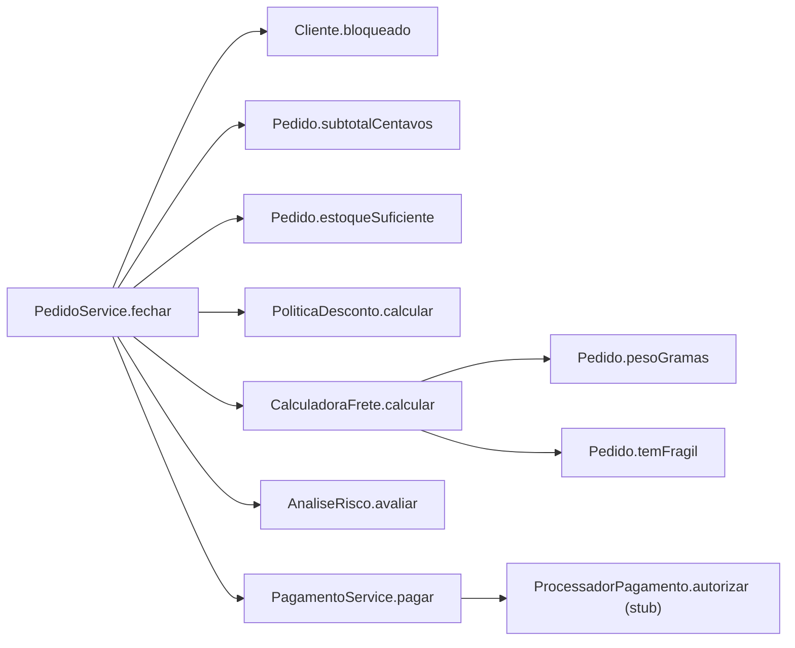
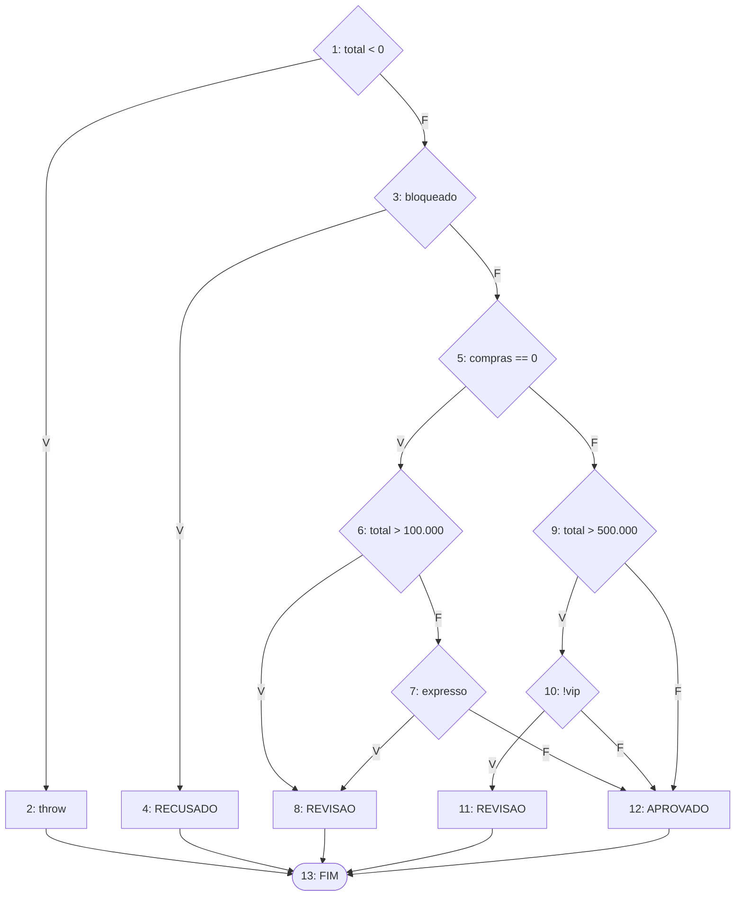
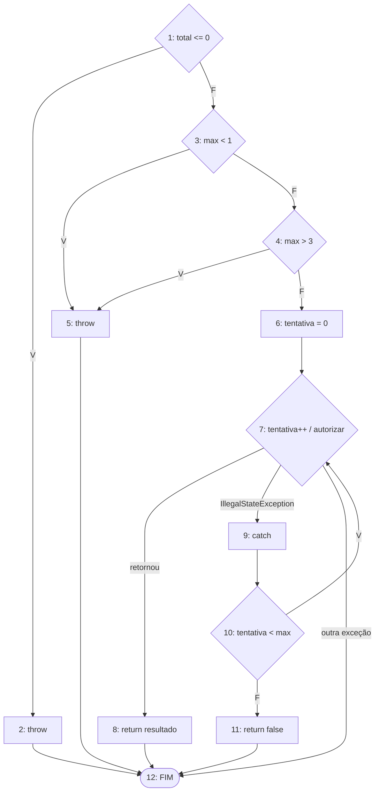
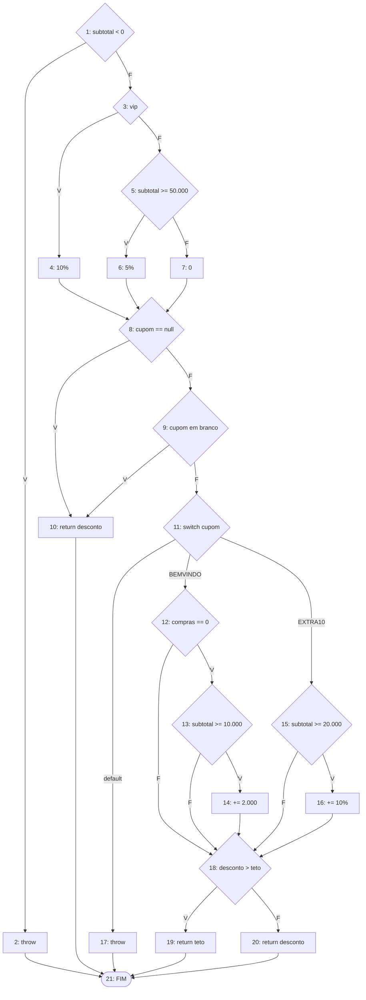
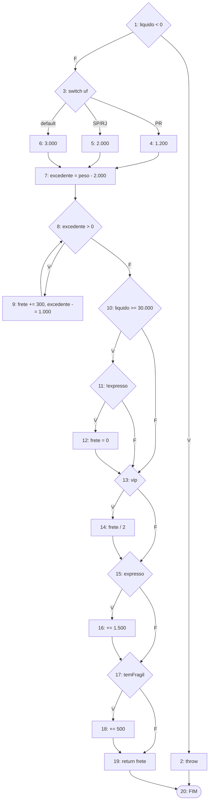
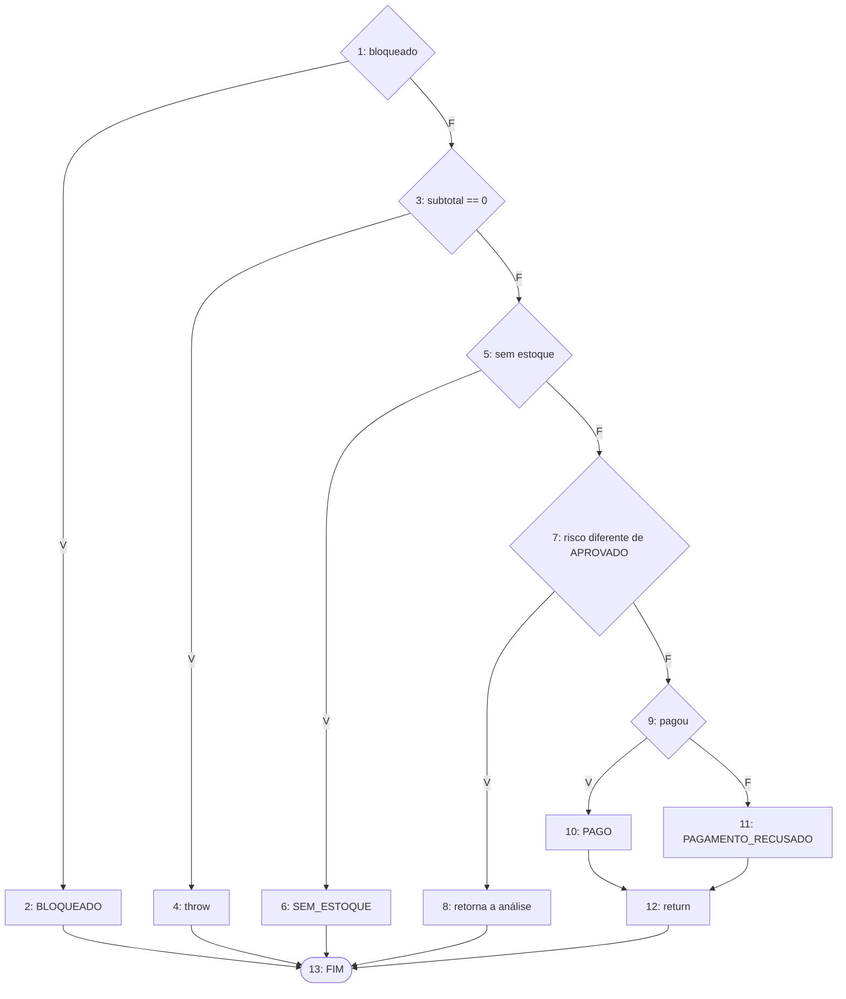
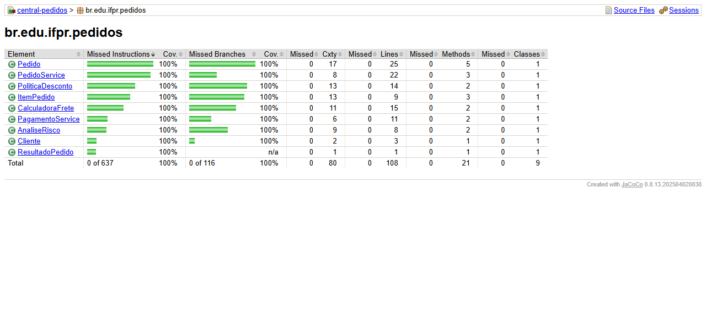

# Relatório do grupo

Integrantes: Gabriel de Souza Carvalho (RA 24027655-2)

Os testes estão em `src/test/java/br/edu/ifpr/pedidos`. Para rodar: `mvn clean test`. Resultado: 176 testes, nenhuma falha. O código de produção não foi alterado.

## Grafos e complexidade

### Grafo de chamadas do fechar

O `PedidoService` usa as classes de desconto, frete, risco e pagamento. O `PagamentoService` depende do `ProcessadorPagamento`, que nos testes foi trocado por um stub que conta as chamadas e guarda os valores recebidos (`StubProcessador`, dentro do `PagamentoServiceTest`).

Como montei os grafos:

- Nos `&&` e `||` cada condição virou um nó separado. Assim V(G) = decisões + 1, igual o JaCoCo conta os branches.
- O switch conta uma saída pra cada destino diferente. No frete, SP e RJ caem no mesmo bloco, então são 3 saídas (PR, SP/RJ e default).
- Todo `return` e `throw` vai pra um nó FIM.
- No `pagar`, a chamada do `autorizar` tem 3 saídas: retorno normal, `IllegalStateException` (vai pro catch) e outra exceção (sai do método).

### AnaliseRisco.avaliar

N = 13, E = 19, V(G) = 19 - 13 + 2 = 8 (7 decisões + 1)

Caminhos:

1. total -1: exceção
2. cliente bloqueado: RECUSADO
3. cliente novo, total 100.001: REVISAO
4. cliente novo, total 1.000, expresso: REVISAO
5. cliente novo, total 100.000, normal: APROVADO
6. cliente antigo não VIP, total 500.001: REVISAO
7. cliente antigo VIP, total 500.001: APROVADO
8. cliente antigo, total 1.000: APROVADO

### PagamentoService.pagar

N = 12, E = 17, V(G) = 17 - 12 + 2 = 7 (4 decisões + o nó 7 com 3 saídas, que soma 2)

O JaCoCo mostra complexidade 5 pro `pagar`, porque ele não conta as saídas de exceção.

Caminhos:

1. total 0: exceção, stub não é chamado
2. max 0: exceção
3. max 4: exceção
4. stub responde true na primeira: true, 1 chamada
5. max 1, stub lança IllegalStateException: false, 1 chamada
6. stub lança IllegalStateException e depois true: true, 2 chamadas
7. stub lança outra exceção: a exceção sobe, 1 chamada

### PoliticaDesconto.calcular

N = 21, E = 31, V(G) = 31 - 21 + 2 = 12 (9 decisões + switch com 3 saídas)

Caminhos:

1. subtotal -1: exceção
2. VIP, 10.000, sem cupom: 1.000
3. comum, 50.000, sem cupom: 2.500
4. comum, 49.999, sem cupom: 0
5. comum, 50.000, cupom "   ": 2.500
6. cliente novo, 15.000, BEMVINDO: 2.000
7. cliente antigo, 15.000, BEMVINDO: 0
8. cliente novo, 9.999, BEMVINDO: 0
9. comum, 20.000, EXTRA10: 2.000
10. comum, 19.999, EXTRA10: 0
11. cupom DESCONTO50: exceção
12. VIP novo, 10.000, BEMVINDO: 2.000 (dava 3.000, mas o teto é 2.000)

O teto (nó 18 verdadeiro) só acontece com BEMVINDO. Com EXTRA10 o máximo é 10% + 10% = 20%, que é igual ao teto e não maior.

### CalculadoraFrete.calcular

N = 20, E = 28, V(G) = 28 - 20 + 2 = 10 (7 decisões + switch com 3 saídas)

Caminho base: PR, 1 kg, líquido 10.000, cliente comum, entrega normal, sem frágil. Os outros mudam uma coisa de cada vez:

1. caminho base: 1.200
2. líquido -1: exceção
3. SP: 2.000
4. MG: 3.000
5. peso 2.001 g: 1.500 (uma volta no while)
6. líquido 30.000: 0 (frete grátis)
7. expresso: 2.700
8. líquido 30.000 e expresso: 2.700 (não ganha frete grátis)
9. VIP: 600
10. item frágil: 1.700

Os nós 11 e 15 dependem da mesma variável (`expresso`), então nem toda combinação é possível. Por exemplo, não dá pra passar no 11 como não expresso e no 15 como expresso.

### PedidoService.fechar

N = 13, E = 17, V(G) = 17 - 13 + 2 = 6 (5 decisões + 1)

Caminhos:

1. cliente bloqueado: BLOQUEADO com tudo zero
2. lista vazia: exceção
3. quantidade maior que o estoque: SEM_ESTOQUE com tudo zero
4. cliente novo com entrega expressa: REVISAO, sem cobrança
5. cliente antigo, R$ 100,00 no PR, stub aprova: PAGO, total 11.200
6. mesmo pedido, stub recusa: PAGAMENTO_RECUSADO

### Resumo

| Método | Nós | Arestas | V(G) | Caminhos independentes | Restrições de viabilidade |
| --- | --- | --- | --- | --- | --- |
| AnaliseRisco.avaliar | 13 | 19 | 8 | 8 | pelo fechar não dá pra cair no RECUSADO nem ter total negativo |
| PagamentoService.pagar | 12 | 17 | 7 | 7 | pelo fechar o total é sempre positivo e o máximo é sempre 3 |
| PoliticaDesconto.calcular | 21 | 31 | 12 | 12 | teto só com BEMVINDO |
| CalculadoraFrete.calcular | 20 | 28 | 10 | 10 | nós 11 e 15 dependem do mesmo `expresso` |
| PedidoService.fechar | 13 | 17 | 6 | 6 | nenhuma |

## Matriz de testes

| ID / método JUnit | Unidade | Entrada e estado do stub | Resultado esperado | Caminho / aresta | Critério atendido |
| --- | --- | --- | --- | --- | --- |
| ClienteTest (3 testes) | Cliente | histórico 0, 7 e -1 | cria ou lança exceção | validação | limite |
| ItemPedidoTest (29 testes) | ItemPedido | SKU, preço, quantidade, estoque e peso nos limites | cria ou lança exceção | todas as validações | valor limite, curto-circuito |
| PedidoTest (38 testes) | Pedido | listas com 0, 1, várias e 101 linhas, UF inválida, itens inativos | subtotal, peso, frágil e estoque certos | laços com continue e break | laço 0/1/várias vezes |
| clienteComumRecebeCincoPorCento... | PoliticaDesconto | 49.999, 50.000, 50.001 | 0, 2.500, 2.500 | caminhos 3 e 4 | limite e truncamento |
| bemVindo... | PoliticaDesconto | cliente novo/antigo, 9.999 a 15.000 | 2.000 ou 0 | caminhos 6, 7 e 8 | limite, curto-circuito |
| vipComBemVindoEhLimitadoAoTeto | PoliticaDesconto | VIP novo, 10.000, BEMVINDO | 2.000 | caminho 12 | teto |
| extra10... | PoliticaDesconto | 19.999, 20.000, 50.000 | 0, 2.000, 7.500 | caminhos 9 e 10 | limite |
| cupomDesconhecidoLancaExcecao | PoliticaDesconto | DESCONTO50 e outros | exceção | caminho 11 | default do switch |
| deveAplicarTarifaBasePorUf | CalculadoraFrete | PR, SP, RJ, MG, ZZ | 1.200, 2.000, 2.000, 3.000, 3.000 | caminhos 1, 3 e 4 | todos os cases |
| deveCobrarTresReaisPorKgOuFracao... | CalculadoraFrete | 2.000 a 10.000 g | 1.200 a 3.600 | caminho 5 | while 0, 1, 2, 4 e 8 vezes |
| liquidoNoLimiteZeraFrete / entregaExpressa... | CalculadoraFrete | líquido 29.999 e 30.000, normal e expresso | 1.200, 0, 2.700 | caminhos 6 e 8 | limite |
| vip... / fragil... / expresso... | CalculadoraFrete | VIP, frágil, expresso | 600, 1.700, 3.500 | caminhos 7, 9 e 10 | ramos |
| todosOsAdicionaisCombinados | CalculadoraFrete | MG, 3,5 kg, VIP, expresso, frágil | 3.800 | várias decisões juntas | combinação |
| clienteNovo / clienteComCompras | AnaliseRisco | totais 100.000/100.001 e 500.000/500.001 | APROVADO ou REVISAO | caminhos 3 a 8 | limite, curto-circuito |
| clienteBloqueadoEhRecusado | AnaliseRisco | bloqueado | RECUSADO | caminho 2 | retorno antecipado |
| deveRejeitar... | PagamentoService | total 0, max 0 e 4 | exceção, 0 chamadas | caminhos 1, 2 e 3 | exceção |
| aprovacaoNaPrimeiraTentativa / recusaEhDefinitiva... | PagamentoService | stub [true] e [false] | true / false, 1 chamada | caminho 4 | uma tentativa |
| aprovacaoNaTerceiraTentativa / esgotar... | PagamentoService | stub com IllegalStateException | true ou false, 2 ou 3 chamadas | caminhos 5 e 6 | do/while várias vezes |
| outraExcecaoPropaga... | PagamentoService | stub lança outra exceção | exceção sobe, 1 chamada | caminho 7 | try/catch |
| clienteBloqueadoRetornaBloqueado... | PedidoService | bloqueado, lista vazia, cupom inválido | BLOQUEADO, 0 cobranças | caminho 1 | retorno antecipado |
| pedidoSemItensLancaExcecao | PedidoService | lista vazia | exceção | caminho 2 | exceção |
| faltaDeEstoqueRetornaSemEstoque... | PedidoService | quantidade 3, estoque 2 | SEM_ESTOQUE, 0 cobranças | caminho 3 | retorno antecipado |
| clienteNovoComEntregaExpressa... | PedidoService | cliente novo, expresso | REVISAO, 0 cobranças | caminho 4 | colaboração |
| deveFecharPedido... (exemplo) | PedidoService | stub [true] | PAGO, 11.200 | caminho 5 | caminho feliz |
| pagamentoRecusadoMantemValores... | PedidoService | stub [false] | PAGAMENTO_RECUSADO | caminho 6 | colaboração |
| combinaCupomExtra10PesoExcedente... | PedidoService | SP, 3,5 kg, frágil, " extra10 " | PAGO, total 25.600 | caminho 5 | todas as regras juntas |

## Evolução da cobertura

| Etapa | Testes executados | Linhas | Branches | Métodos | Classes | Lacunas e justificativas |
| --- | --- | --- | --- | --- | --- | --- |
| Inicial | 0 | Não medido | Não medido | Não medido | Não medido | Sem testes |
| Só o exemplo | 1 | 80,6% | 43,1% | 95,2% | 9/9 | só o caminho feliz |
| Cliente, ItemPedido e Pedido | 71 | 82,4% | 59,5% | 95,2% | 9/9 | faltava desconto, frete e risco |
| Desconto e frete | 126 | 93,5% | 82,8% | 95,2% | 9/9 | faltava risco e pagamento |
| Risco e pagamento | 157 | 98,1% | 95,7% | 95,2% | 9/9 | faltava os retornos do fechar |
| PedidoService | 176 | 100% | 100% | 100% | 9/9 | nenhuma |

## Análise crítica

**Quais combinações faltavam mesmo com os ramos cobertos?**

No frete deu 100% de branches com poucos testes, mas as regras de frete grátis, VIP, expresso e frágil são independentes e têm muito mais combinações do que isso, ainda mais com o while no meio. Por exemplo, "UF de fora + peso excedente + VIP + expresso + frágil" não cobre nenhum ramo novo, só testei porque fiz um teste a mais pra isso. Então 100% de branches não quer dizer que todos os caminhos foram testados.

**Quais condições não foram avaliadas devido ao curto-circuito?**

- SKU nulo: o `isBlank()` não roda
- lista ou UF nula no Pedido: o `size()` e o `matches` não rodam
- item inativo no `temFragil`: não olha se é frágil
- BEMVINDO com cliente antigo: não olha o subtotal
- risco de cliente novo com total alto: não olha o expresso
- risco de cliente antigo com total baixo: não olha se é VIP

Testei cada condição verdadeira e falsa, mas isso ainda não é MC/DC.

**Quais caminhos são inviáveis no serviço, mas viáveis na unidade?**

O RECUSADO do risco, porque o `fechar` já retorna BLOQUEADO antes. Os valores negativos no desconto, frete e risco, porque o subtotal sempre é positivo e o desconto é no máximo 20%. E no pagamento, o total inválido e o máximo diferente de 3, porque o `fechar` sempre chama `pagar(total, 3)`. Esses casos foram testados direto nas classes.

**Como foram testadas exceções e quantidades de iterações?**

Exceções com `assertThrows`, conferindo a mensagem e se o stub não foi chamado quando não devia. Os laços do Pedido com lista vazia, com uma e com várias linhas. O while do frete com 0, 1, 2, 4 e 8 voltas. O do/while do pagamento com 1, 2 e 3 tentativas, conferindo quantas vezes o stub foi chamado.

Exceção que não aparece nos branches do JaCoCo: o catch do `pagar`. Ele aparece só como linha coberta, mas foi testado nos testes de indisponibilidade.

**Qual alteração proposital foi detectada por qual teste? A alteração foi desfeita?**

Fiz três alterações e rodei os testes:

1. No desconto troquei `subtotal >= 50_000` por `subtotal > 50_000`. Falharam 5 testes, entre eles o `clienteComumRecebeCincoPorCentoAPartirDeQuinhentosReais`.
2. No frete troquei `excedente > 0` por `excedente >= 0`. Falharam 4 testes do peso.
3. No pagamento troquei `tentativa < maxTentativas` por `<=`. Falharam 4 testes, entre eles o `esgotarTresTentativasRetornaFalse`.

Desfiz as três e os testes voltaram a passar.
