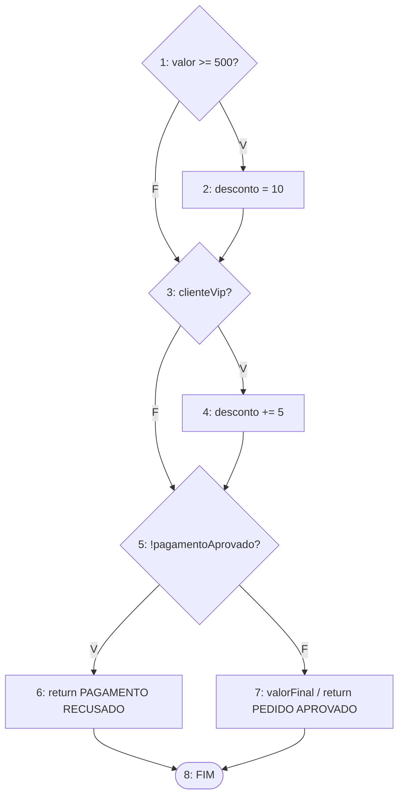

# Exercício 1 - Classificação de pedido

```java
public String classificarPedido(double valor, boolean clienteVip, boolean pagamentoAprovado) {
    double desconto = 0;

    if (valor >= 500) {
        desconto = 10;
    }

    if (clienteVip) {
        desconto += 5;
    }

    if (!pagamentoAprovado) {
        return "PAGAMENTO RECUSADO";
    }

    double valorFinal = valor - (valor * desconto / 100);
    return "PEDIDO APROVADO: " + valorFinal;
}
```

## 1. Blocos básicos

- B1: `double desconto = 0;` e o teste `valor >= 500`
- B2: `desconto = 10;`
- B3: teste `clienteVip`
- B4: `desconto += 5;`
- B5: teste `!pagamentoAprovado`
- B6: `return "PAGAMENTO RECUSADO";`
- B7: cálculo do `valorFinal` e `return "PEDIDO APROVADO: " + valorFinal;`
- FIM: nó de saída, onde os dois return se encontram

## 2. Decisões

- D1: `valor >= 500` (B1). Verdadeiro vai pro B2, falso vai pro B3
- D2: `clienteVip` (B3). Verdadeiro vai pro B4, falso vai pro B5
- D3: `!pagamentoAprovado` (B5). Verdadeiro vai pro B6, falso vai pro B7

## 3 e 4. Grafo

O return do B6 é o encerramento antecipado: ele vai direto pro FIM e não passa pelo B7.



## 5. Nós e arestas

N = 8 (nós 1 a 7 e o FIM)

Arestas: 1-2, 1-3, 2-3, 3-4, 3-5, 4-5, 5-6, 5-7, 6-8, 7-8

E = 10

## 6 e 7. Complexidade ciclomática

V(G) = E - N + 2 = 10 - 8 + 2 = 4

V(G) = decisões + 1 = 3 + 1 = 4

As duas contas deram 4. Obs: precisa do nó FIM juntando os dois return. Sem ele ficaria N = 7 e E = 8, e a conta daria 3, que está errado.

## 8, 9 e 10. Caminhos independentes

| Caminho | Nós | valor | clienteVip | pagamentoAprovado | Resultado esperado |
| --- | --- | --- | --- | --- | --- |
| 1 | 1-2-3-4-5-7-8 | 600 | true | true | PEDIDO APROVADO: 510.0 |
| 2 | 1-3-4-5-7-8 | 100 | true | true | PEDIDO APROVADO: 95.0 |
| 3 | 1-2-3-5-7-8 | 600 | false | true | PEDIDO APROVADO: 540.0 |
| 4 | 1-2-3-4-5-6-8 | 600 | true | false | PAGAMENTO RECUSADO |

Cada caminho novo passa por pelo menos uma aresta que ainda não tinha sido usada, e os 4 juntos passam por todas as 10 arestas.

Também testaria o limite do primeiro if: valor 500 dá "PEDIDO APROVADO: 450.0" (tem desconto) e 499.99 dá "PEDIDO APROVADO: 499.99" (sem desconto).

## Questões para discussão

**Quantas combinações entre as três condições são possíveis?**

2 x 2 x 2 = 8 combinações.

**O número de combinações é igual à complexidade ciclomática?**

Não. A complexidade é 4 e as combinações são 8. A complexidade diz quantos caminhos independentes formam a base, ou seja, o mínimo pra passar por todas as arestas. Os outros caminhos são combinações desses. As decisões somam na complexidade (3 + 1), mas multiplicam nas combinações (2³).

**Como o return dentro da terceira condição altera o grafo?**

Ele cria uma segunda saída do método. O B6 liga direto no FIM e pula o cálculo do valor final. Por isso o grafo precisa de um nó FIM juntando os dois return.

**É possível executar o cálculo de valorFinal quando o pagamento não foi aprovado?**

Não. O B7 só é alcançado pela saída falsa do `!pagamentoAprovado`, ou seja, quando o pagamento foi aprovado. Se foi recusado, o fluxo sempre vai do 5 pro 6 e termina.
