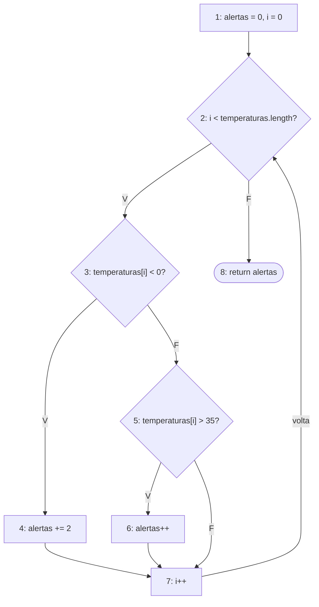

# Exercício 2 - Análise de leituras de temperatura

```java
public int contarAlertas(double[] temperaturas) {
    int alertas = 0;
    int i = 0;

    while (i < temperaturas.length) {
        if (temperaturas[i] < 0) {
            alertas += 2;
        } else if (temperaturas[i] > 35) {
            alertas++;
        }

        i++;
    }

    return alertas;
}
```

## 1. Blocos básicos

- B1: `int alertas = 0;` e `int i = 0;`
- B2: condição do while `i < temperaturas.length`
- B3: `temperaturas[i] < 0`
- B4: `alertas += 2;`
- B5: `temperaturas[i] > 35` (else if)
- B6: `alertas++;`
- B7: `i++;`
- B8: `return alertas;`

## 2. Decisões

- D1: while `i < temperaturas.length` (B2). Verdadeiro entra no laço (B3), falso sai do laço (B8)
- D2: if `temperaturas[i] < 0` (B3). Verdadeiro vai pro B4, falso vai pro B5
- D3: else if `temperaturas[i] > 35` (B5). Verdadeiro vai pro B6, falso vai pro B7

## 3 e 4. Grafo



- Entrada no laço: 2-3
- Temperatura negativa: 3-4. Acima de 35: 3-5-6. Entre 0 e 35: 3-5-7
- Incremento do i: nó 7
- Retorno do laço: 7-2
- Saída do laço: 2-8

## 5. Nós e arestas

N = 8

Arestas: 1-2, 2-3, 2-8, 3-4, 3-5, 5-6, 5-7, 4-7, 6-7, 7-2

E = 10

## 6. Complexidade ciclomática

V(G) = E - N + 2 = 10 - 8 + 2 = 4

V(G) = decisões + 1 = 3 + 1 = 4 (while, if e else if)

Como só tem um return, o B8 já é a saída, não precisa de um nó FIM a mais.

## 7, 8 e 9. Caminhos independentes

| Caminho | Nós | Vetor | Retorno |
| --- | --- | --- | --- |
| 1 | 1-2-8 | {} | 0 |
| 2 | 1-2-3-4-7-2-8 | {-5} | 2 |
| 3 | 1-2-3-5-6-7-2-8 | {40} | 1 |
| 4 | 1-2-3-5-7-2-8 | {20} | 0 |

- Caminho 1: sai do laço sem nenhuma iteração
- Caminho 2: ramo da temperatura negativa
- Caminho 3: ramo acima de 35
- Caminho 4: temperatura entre 0 e 35

Outros testes que fiz pras fronteiras: {0} retorna 0, {35} retorna 0, {-0.1} retorna 2, {35.1} retorna 1. Um vetor com várias posições, {-3, 10, 36, 35, 0, -1}, retorna 5 (2 + 0 + 1 + 0 + 0 + 2).

## 10. Por que o retorno do laço precisa aparecer no CFG?

Porque é ele que mostra que o laço repete. Sem a aresta 7-2 o grafo daria a entender que o corpo do while roda só uma vez, e depois de processar um elemento não teria como voltar a testar a condição. Também muda a conta: sem essa aresta E seria 9 e V(G) daria 3.

## Questões para discussão

**Um vetor com várias temperaturas percorre um único caminho ou pode repetir partes do grafo?**

Repete partes do grafo. A cada elemento o fluxo volta pro nó 2 e passa de novo pelo corpo do laço, podendo ir por um ramo diferente em cada volta. Por exemplo, {-3, 10, 36} passa por 3-4, depois 3-5-7, depois 3-5-6.

**Qual entrada permite sair do método sem acessar uma posição do vetor?**

O vetor vazio. A condição 0 < 0 já é falsa na primeira vez, então vai direto pro return e retorna 0 sem ler `temperaturas[i]`.

**Os testes dos valores 0 e 35 ajudam a avaliar quais fronteiras?**

O 0 testa a fronteira do `temperaturas[i] < 0` e o 35 testa a do `temperaturas[i] > 35`. Os dois não geram alerta. Se alguém trocasse `<` por `<=` ou `>` por `>=`, esses testes pegariam o erro.

**Por que o else if deve ser representado como uma nova decisão?**

Porque é outra condição, com saída verdadeira e falsa própria, que só é testada quando a primeira dá falso. É como um if dentro do else. Se juntasse com a primeira decisão, perderia um dos ramos e a complexidade daria 3.
